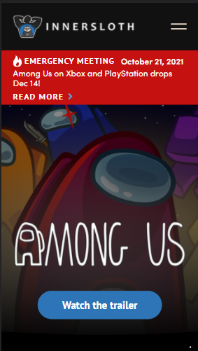
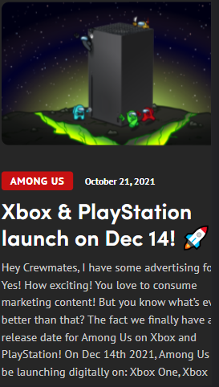
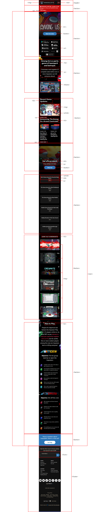
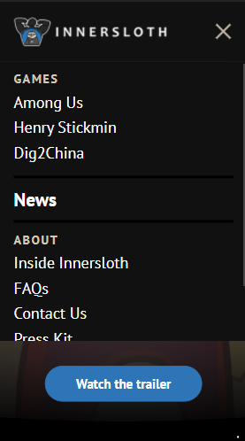
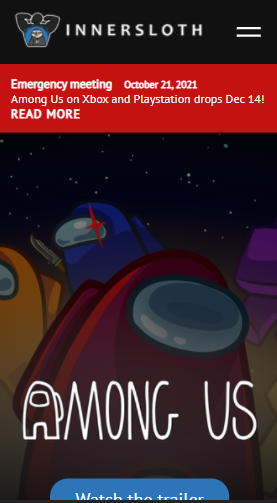
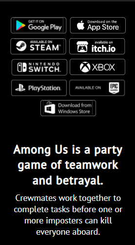
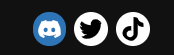
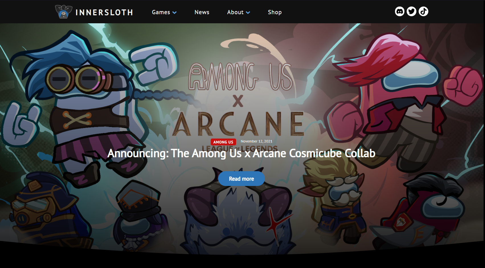

# Procesverslag
Markdown is een simpele manier om HTML te schrijven.  
Markdown cheat cheet: [Hulp bij het schrijven van Markdown](https://github.com/adam-p/markdown-here/wiki/Markdown-Cheatsheet).

Nb. De standaardstructuur en de spartaanse opmaak van de README.md zijn helemaal prima. Het gaat om de inhoud van je procesverslag. Besteedt de tijd voor pracht en praal aan je website.

Nb. Door *open* toe te voegen aan een *details* element kun je deze standaard open zetten. Fijn om dat steeds voor de relevante stuk(ken) te doen.

## Jij

uitwerken voor kick-off werkgroep

### Auteur:
Laurens Duin

#### Je startniveau:
Rood

#### Je focus:
Surface plane

## Je website

uitwerken voor kick-off werkgroep

### Je opdracht:
https://www.innersloth.com/games/among-us/

#### Screenshot(s) van de eerste pagina (small screen): 
https://www.innersloth.com/games/among-us/ - Home pagina van de game; among us

#### Screenshot(s) van de tweede pagina (small screen):
https://www.innersloth.com/news/ nieuwspagina van de game studio; Innersloth

 

## Breakdownschets (week 1)

uitwerken na afloop 2e werkgroep

### de hele pagina: 

### dynamisch deel (bijv menu): 

## Voortgang 1 (week 2)

uitwerken voor 1e voortgang

### Stand van zaken
Ik begon eerst met een niet zo goed begin omdat ik al best wel veel code had geschreven voor een desktop versie terwijl het eerst voor een mobiel moet. Gelukkig was veel van mijn code al redelijk overdraagbaar dus kon ik dat prima bij trekken. Ik ben vooral bezig geweest met de nav en de eerste pagina van de site. Dit is een deel van wat ik tot nu toe heb: 

### Agenda voor meeting
Voor de meeting hadden we als groepje nog niks besproken. De studentassistenten hebben mij wel geholpen met een vraag over mijn hamburger menu.

### Verslag van meeting
- In plaats van: transform: rotate(0deg) rotate(45deg); --> transform: translateY(.3em) rotate(45deg); om de draaianimatie voor de mobile nav te laten werken.

## Voortgang 2 (week 3)

uitwerken voor 2e voortgang

### Stand van zaken
Het gaat best wel goed qua vooruitgang. Vasilis heeft me in de les geholpen met svg's waardoor ik nu hover/focus states kan maken

### Agenda voor meeting
Eigenlijk had niemand van tevoren vragen.

### Verslag van meeting
We hebben in de meeting allemaal onze code laten zien en de student assistenten hebben feedback gegeven of verbeteringen voorgesteld. Een verbetering die bij mij naar voren kwam is dat ik het hamburger menu in een button kan doen ipv een div. Toen ik dit probeerde brak het dus daar moet ik later nog naar kijken.

## Toegankelijkheidstest (week 4)

uitwerken na test in 8e voortgang

### Bevindingen
Lijst met je bevindingen die in de test naar voren kwamen:

#### Titel eerste bevinding
Parkinson test

Deze test had voor mij het meeste effect. Ik moest heel erg wennen aan de trillende vingers waardoor ik vaak per ongeluk de muis indrukte. Toen ik er een beetje aan gewent was, ging het navigeren van mijn site best goed. Ik hoef dus geen grote aanpassingen te maken.

#### Titel tweede bevinding. 
Peripheral vision loss bril

Van de brillen vond ik dit de irritantste. Mijn site was nog goed te gebruiken maar soms moest ik wel wat langer kijken voordat ik alles goed zag. Een oplossing hiervoor zou kunnen zijn om de lettertypen te verhogen.

#### Titel volgende bevinding. 
Blur/glare bril

Deze bril maakte het vooral lastig om van veraf de pagina goed te zien. Het kostte mij meer focus om alles helemaal te lezen. De koppen kon ik wel in een oogopslag lezen waardoor ik de pagina makkelijk kon scannen.

#### Titel nog een bevinding. 
Screen reader test

Voor deze test hebben we een screanreader gebruikt. Ik heb de ingebouwde windows narrator gebruikt. Wat mij meteen opviel was dat mijn alt teksten niet overal even sterk waren. Zo heb ik waar ik voorheen "twitter logo" had als alt tekst nu: "twitter". Dit is een stuk minder lang, zeker wanneer je een hele lijst me social medias hebt. Omdat de screenreader voorleest dat het om een link gaat, is het nog steeds duidelijk wat de knop doet.

Ook heb ik wat verbeteringen toegevoegd aan mijn email form. Zo heeft de submit knop nu wel een value en wanneer je email niet valid is (of juist wel) krijg je het meteen te horen.

## Voortgang 3 (week 4)

uitwerken voor 3e voortgang

### Stand van zaken
Ik ben voor dit gesprek bezig geweest met de start van mijn eerste pagina. Ik ben nog niet heel ver hiermee.

### Agenda voor meeting
Wederom hadden we als groepje van tevoren geen vragen. Tijdens het gesprek zijn er wel wat naar boven gekomen.

### Verslag van meeting
Het voornaamste wat ik heb meegenomen uit dit gesprek is hoe ik de email in de form kan valideren. Ik had het voor het gesprek alleen met Javascript gedaan. Als ik tijd over heb ga ik kijken of het ook (goed) lukt met alleen CSS.

## Eindgesprek (week 5)

uitwerken voor eindgesprek

### Stand van zaken
hier dit ging goed & dit was lastig (neem ook screenshots op van delen van je website en code)

### Screenshot(s)

hier screenshot(s) van je eindresultaat

## Bronnenlijst

continu bijhouden terwijl je werkt

1. Kirby gif gemaakt door Himika1222 via: https://www.deviantart.com/himika1222/art/Day-2-of-Vacation-Kirby-Gif-616230092
2. Javascript email validator (regular expression): https://stackoverflow.com/questions/49209362/what-is-the-meaning-of-s-s-gm-in-javascript

